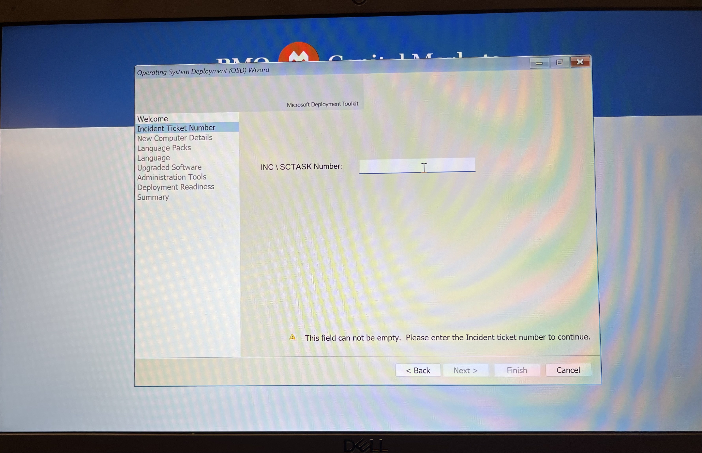

# Laptop-Rebuild
Laptop Rebuild and Windows Deployment


<h2>Description</h2>
To rebuild a laptop with Windows 10 or Windows 11, configure system settings, and complete initial software installation and domain configuration in a corporate IT environment.
<br />


<h2>Languages and Utilities Used</h2>

- <b>Active Directory (for domain/OU placement)</b> 
- <b>Citrix Workspace</b>
- <b>ITSM platform (for INC tracking)</b>
- 


<h2>Environments Used </h2>

- <b>Bootable USB with Windows 10/11 image</b> 


<h2>Program walk-through:</h2>

<p align="center">
1. Boot from USB: <br/>

<br />
<br />
  <b>Insert the pre-configured bootable USB containing Windows 10/11 deployment files.

Access the boot menu and select the USB drive.

Enter the administrator password if prompted to proceed.
<br />
<br />

</b> 
2.Select Operating System:  <br/>

<b>Choose between Windows 10 or Windows 11 based on the organizational requirement or user need.


<br />
<br />
3.Input INC Number:: <br/>

<br />
<br />
 <b>Enter the INC (Incident) number to associate the rebuild with the service ticket or task assigned through the IT service management platform.


<br />
<br />
</b>
4.Enter Asset Information and Domain Details:
  <br/>
<br />
 <b>Input the Asset Tag of the machine.

Select the appropriate domain and Organizational Unit (OU) to ensure the device is added to the correct group policy and configuration structure.</b> 
<br />
<br />

</b>
5.Install Citrix Workspace::
  <br/>

 <b>Download and install Citrix Workspace to allow secure access to virtual desktops and enterprise applications.</b> 
<br />
<br />
 </b>
6.Finalize and Monitor Installation:
  <br/>

<br />
<br />
 <b>Complete the setup and allow the system to finish all updates and installations.

Confirm that all required policies are applied and that the user profile loads correctly upon login</b> 


<!--
 ```diff
- text in red
+ text in green
! text in orange
# text in gray
@@ text in purple (and bold)@@
```
--!>
